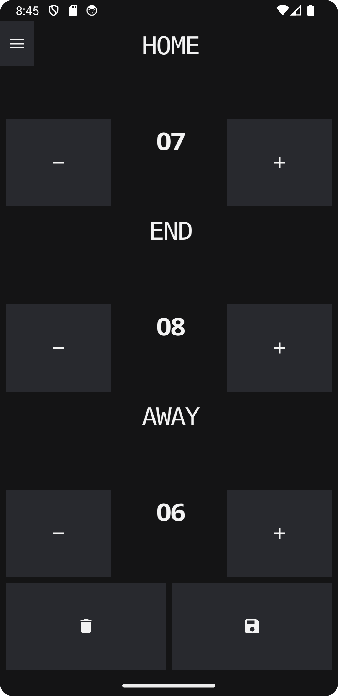
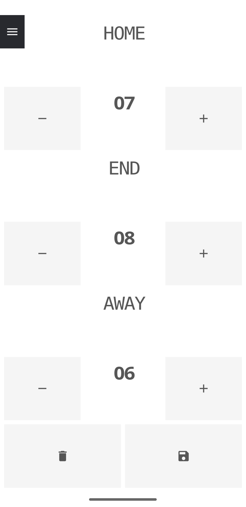
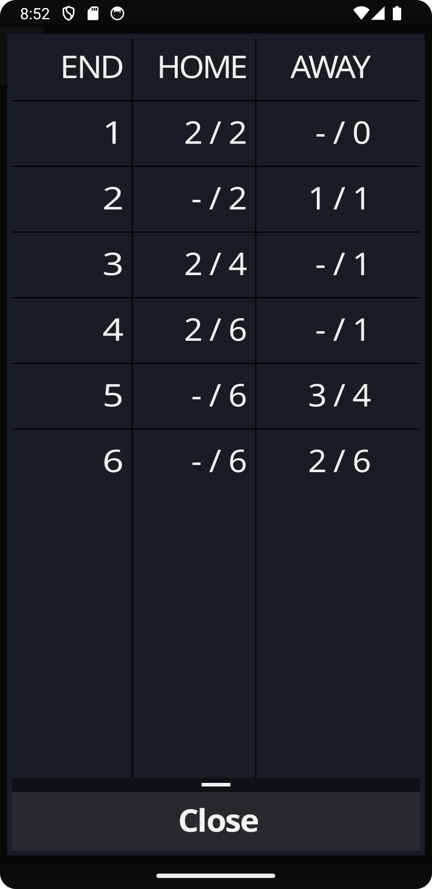
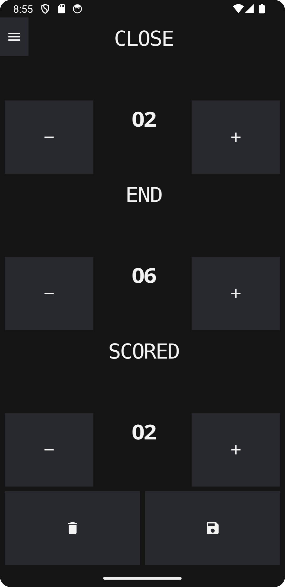
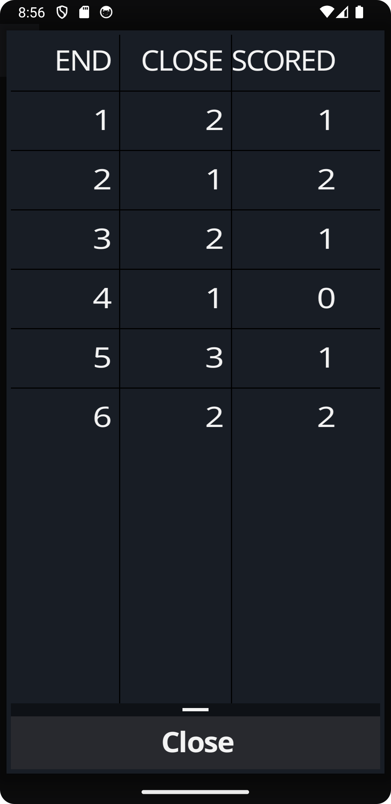
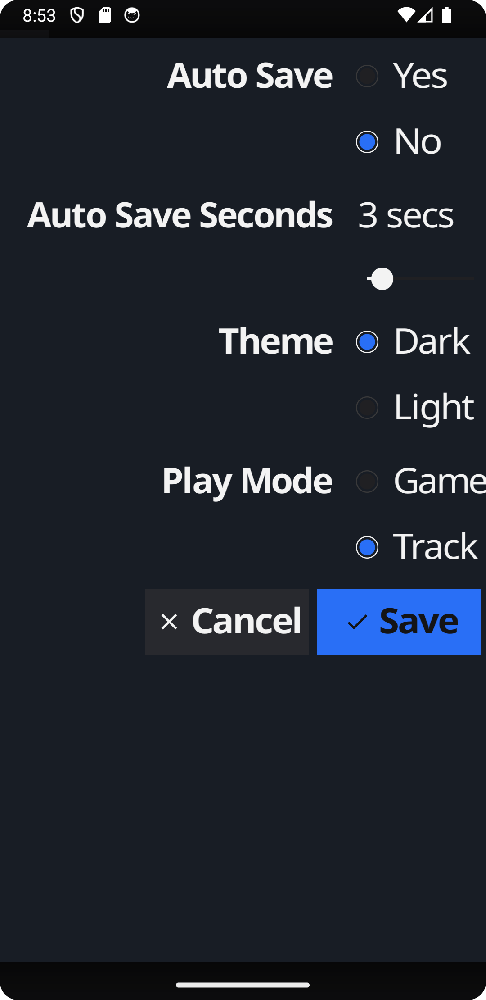

#  github.com/chippyash/bowlsscore
## Bowls Score: Lawn Bowls Scoring and Personal Tracker. Free Version

_copyright (c) Ashley Kitson, UK, 2023_

Licence: BSD-3-Clause See LICENSE

## What
Provides a mobile (Android only atm) app that allows you to:
 - record the scores for a Lawn Bowls match
 - track your personal performance in a match

### Game mode
Record and present the results of a game. Unlimited ends.

Record (Dark theme) 
Record (Light theme) 
Results 

### Track mode
Record your progress in a game. Record how many bowls were 'close' to the jack, and how many ended up scoring. Closeness
is dependent on you and your skill level. Could be anything within 1 metre, 1/2 metre, centimetres!

Record 
Results 

### Preferences

Preferences features an 'Auto Score' setting. Turning this on is particularly useful in Game mode as it means you only have to record the increase in score for the end winning team. The 'Auto save seconds' can be set to anything between 1 and 15 seconds.  When you enter the score and after the specified time, the ends will be incremented and the end result saved.

Open `docs/autoscore.webm` to see auto scoring.

## How
### Development

 - [Install Go V1.18+](https://go.dev/doc/install)
 - [Install Fyne](https://developer.fyne.io/started/)
 - [Install Android Support](https://developer.android.com/) NB Android Studio _does not_ support Go development but
you can install it to get all the dependencies
 - [Install ADB](https://www.xda-developers.com/install-adb-windows-macos-linux/)
 - run `make package` to create the android APK package
 - connect your android device via USB, set developer mode on with USB support and run `make deploy-local` to build and
deploy the app to your device
 - run `make run` to run the app on your local machine - useful for developing

## Roadmap
 - Save results to file as CSV
 - Save results to file as PDF in standard bowls scorecard format
 - Link to contacts
 - Personalise the results scorecard with contacts
 - Save results to cloud
 - More themes
 - Send results to contacts
 - Scorecard signatures

'Bowls Score' will remain free. If features require the developers to have to pay for resources/services in order to provide the feature, those features will only be available in a paid for version of the app.

## References
 - [Developed with Fyne](https://fyne.io/)
 - [Scoring in Lawn Bowls](https://www.jackhighbowls.com/help/how-to-fill-in-a-lawn-bowls-scorecard/#:~:text=3%E2%80%9D%20is%20playing.-,The%20Score,team%20in%20the%20TOTALS%20column.)